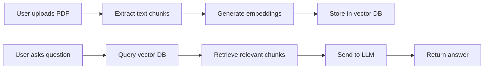

# 📄 Mini PDF QA App

A minimal **Next.js** application that allows users to upload PDFs, generate embeddings, and query them in natural language using an LLM.

[](https://nextjs.org/)
[](https://www.typescriptlang.org/)
[](https://tailwindcss.com/)
[](https://openai.com/)

---

## ✨ Features

- 📑 **PDF Upload & Parsing** – Extracts text from uploaded PDFs with intelligent chunking
- 🧠 **Vector Embeddings** – Uses OpenAI embeddings for semantic search capabilities
- ❓ **Natural Language QA** – Ask questions about your PDFs in plain English
- 💬 **Interactive Chat UI** – Modern chat interface with message bubbles and typing indicators
- 🔍 **Semantic Search** – Find relevant content even when exact keywords don't match
- ⚡ **Real-time Processing** – Fast upload and query processing

---

## 🎯 Demo

*Upload any PDF document and start asking questions about its content instantly!*

### Example Interactions:
- "What are the main topics covered in this document?"
- "Summarize the key findings from chapter 3"
- "What does the author say about [specific topic]?"

---

## 📂 Project Structure

```
mini-pdf-qa-app/
├── app/
│   ├── api/
│   │   ├── ask/
│   │   │   └── route.ts          # Question answering endpoint
│   │   └── upload/
│   │       └── route.ts          # PDF upload handler
│   ├── globals.css               # Global styles
│   ├── layout.tsx                # Root layout component
│   └── page.tsx                  # Main application page
├── components/
│   ├── FileUploader.tsx          # Drag & drop PDF uploader
│   ├── MessageBubble.tsx         # Chat message component
│   └── QuestionBox.tsx           # Question input interface
├── lib/
│   ├── embeddings.ts             # OpenAI embeddings integration
│   ├── pdf.ts                    # PDF text extraction utilities
│   └── vector.ts                 # Vector database operations
├── public/                       # Static assets
├── .env.local.example           # Environment variables template
├── package.json
├── tailwind.config.js
└── README.md
```

---

## 🚀 Quick Start

### Prerequisites
- Node.js 18+ installed
- OpenAI API key ([Get one here](https://platform.openai.com/api-keys))

### Installation

1. **Clone the repository**
   ```bash
   git clone https://github.com/your-username/mini-pdf-qa-app.git
   cd mini-pdf-qa-app
   ```

2. **Install dependencies**
   ```bash
   npm install
   # or
   yarn install
   # or
   pnpm install
   ```

3. **Configure environment variables**
   ```bash
   cp .env.local.example .env.local
   ```
   
   Edit `.env.local` and add your OpenAI API key:
   ```env
   OPENAI_API_KEY=sk-your-openai-api-key-here
   ```

4. **Start the development server**
   ```bash
   npm run dev
   ```

5. **Open your browser**
   Navigate to [http://localhost:3000](http://localhost:3000) 🎉

---

## 🏗️ How It Works

### Architecture Overview



### Process Flow

1. **📤 Upload & Extract** 
   - PDFs are uploaded via drag-and-drop interface
   - Text is extracted and split into semantic chunks
   - Handled by `app/api/upload/route.ts` and `lib/pdf.ts`

2. **🔢 Embedding Generation**
   - Text chunks are converted to vector embeddings using OpenAI's text-embedding-3-small
   - Embeddings capture semantic meaning for better search
   - Managed by `lib/embeddings.ts`

3. **💾 Vector Storage**
   - Embeddings are stored in an in-memory vector database
   - Enables fast similarity search for relevant content
   - Implemented in `lib/vector.ts`

4. **🔍 Query Processing**
   - User questions are embedded and matched against stored vectors
   - Most relevant text chunks are retrieved
   - Combined with the question and sent to OpenAI's GPT model

5. **💬 Response Generation**
   - LLM generates contextual answers based on retrieved content
   - Responses are streamed back to the chat interface
   - Displayed using `MessageBubble.tsx` components

---

## 🛠️ Tech Stack

| Category | Technology | Purpose |
|----------|------------|---------|
| **Framework** | Next.js 13+ (App Router) | Full-stack React framework |
| **Language** | TypeScript | Type-safe development |
| **Styling** | TailwindCSS | Utility-first CSS |
| **AI/ML** | OpenAI API | Embeddings & language model |
| **PDF Processing** | pdf-parse | Text extraction from PDFs |
| **Vector Search** | Custom implementation | Similarity search |

---

## 🚀 Deployment

### Deploy to Vercel (Recommended)

1. **Push to GitHub**
   ```bash
   git add .
   git commit -m "Initial commit"
   git push origin main
   ```

2. **Deploy on Vercel**
   - Go to [vercel.com](https://vercel.com/) and sign in
   - Click "Import Project" and select your repository
   - Vercel will auto-detect Next.js settings

3. **Add Environment Variables**
   - In Vercel dashboard: Project Settings → Environment Variables
   - Add: `OPENAI_API_KEY` = `your_openai_api_key`

4. **Deploy** 🚀
   - Vercel builds and deploys automatically
   - Get your live URL instantly

### Alternative Deployment Options

- **Netlify**: Works with static export mode
- **Railway**: Great for full-stack apps
- **Docker**: Container-ready setup available

---

## 🔧 Configuration

### Customization Options

- **Chunk Size**: Modify text splitting in `lib/pdf.ts`
- **Embedding Model**: Change model in `lib/embeddings.ts`
- **LLM Model**: Update GPT model in `app/api/ask/route.ts`
- **UI Theme**: Customize colors in `tailwind.config.js`

### Environment Variables

| Variable | Required | Description |
|----------|----------|-------------|
| `OPENAI_API_KEY` | ✅ | Your OpenAI API key |
| `NODE_ENV` | ❌ | Environment (development/production) |

---

## 🤝 Contributing

Contributions are welcome! Please feel free to submit a Pull Request.

1. Fork the repository
2. Create your feature branch (`git checkout -b feature/AmazingFeature`)
3. Commit your changes (`git commit -m 'Add some AmazingFeature'`)
4. Push to the branch (`git push origin feature/AmazingFeature`)
5. Open a Pull Request

---

## 📝 License

This project is licensed under the **MIT License** - see the [LICENSE](LICENSE) file for details.

---

## 🆘 Support

Having issues? Check out these resources:

- 📖 [Next.js Documentation](https://nextjs.org/docs)
- 🤖 [OpenAI API Documentation](https://platform.openai.com/docs)
- 💬 [GitHub Issues](https://github.com/your-username/mini-pdf-qa-app/issues)

---

**Built with ❤️ using Next.js and OpenAI**
